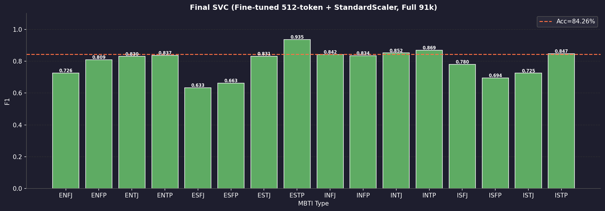
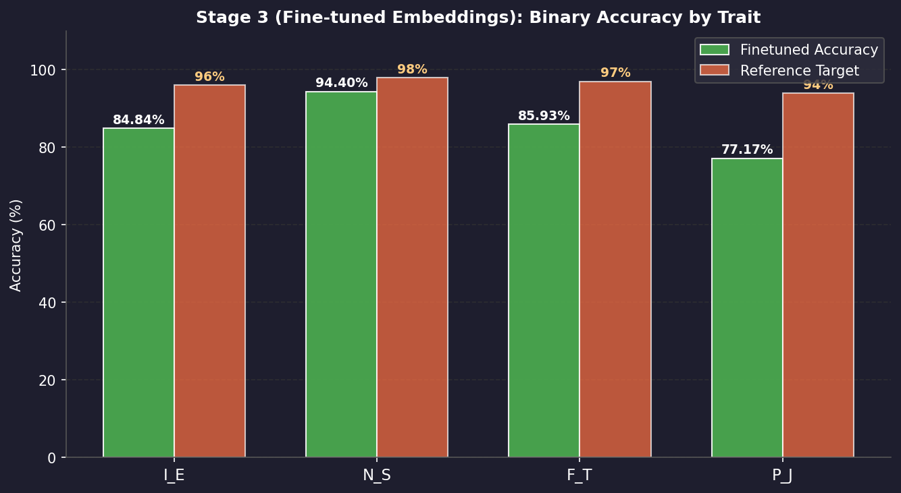
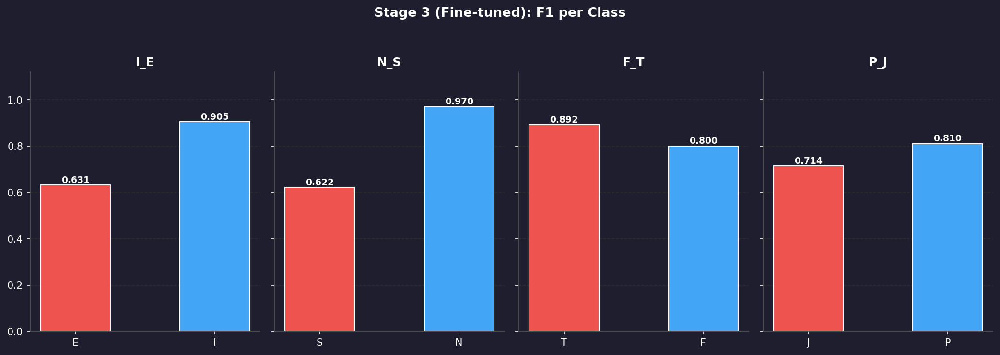

# 🧠 MBTI Personality Prediction using BERT + SVC

<div align="center">


**BERT Fine-tuning + SVC 기반 16개 MBTI 유형 분류 파이프라인**

</div>

---

## 📋 프로젝트 개요

Myers-Briggs Type Indicator(MBTI) 성격 유형을 **소셜 미디어 텍스트**로부터 자동으로 예측하는 딥러닝 파이프라인입니다.

- **114,741개** 샘플 (2개 데이터셋 병합 · 전처리)
- **bert-base-uncased** 파인튜닝 (max_length=512)
- **16개 클래스** 동시 분류 + **4대 지표 이진 분류** 병행
- **최종 Test Accuracy 84.26%** (SVC, 16-class)

---

## 🏗️ 파이프라인 아키텍처

```
[Raw Data]
    ├─ Dataset 1: mbti_1.csv          (~62.8 MB, 8,675 rows)
    └─ Dataset 2: MBTI 500 Dataset    (~106k rows)
         ↓
[Phase 2] preprocess.py
    → 전처리 (URL 제거, lemmatize, 불용어 제거 등)
    → pd.concat() 병합
    → 길이 2 이하 · 빈도 5 미만 제거
    → final_preprocessed_mbti.csv (114,741 rows)
         ↓
[Phase 3 - Stage 1] train_baseline.py
    → bert-base-uncased CLS 임베딩 추출 (128 토큰)
    → RandomForestClassifier  ──────────── Accuracy: 29.0%
         ↓
[Phase 3 - Stage 2] pipeline_full_512.py (Step 1)
    → BertForSequenceClassification Fine-tuning
    → max_length=512, batch=16, lr=2e-5, 4 epochs
    → Best Val Acc: 84.35% (Epoch 3)  ────ckpt: best_finetuned_512.pt
         ↓
[Phase 3 - Stage 3] pipeline_full_512.py (Step 2)
    → Fine-tuned 모델로 CLS 임베딩 재추출 (512 토큰)
    → finetuned_embeddings_512.npy (114,741 × 768)
         ↓
[Phase 3 - Stage 4] train_binary.py
    → 4대 지표별 이진 LogisticRegression
    → I/E 84.8%  N/S 94.4%  F/T 85.9%  P/J 77.2%
         ↓
[Phase 3 - Stage 5] pipeline_full_512.py (Step 3)  ★ 최종
    → StandardScaler → SVC(C=1, kernel='rbf', gamma='auto')
    → 전체 91k Train 데이터 사용
    ──────────────────────────── Final Test Accuracy: 84.26%
```

---

## 📊 실험 결과

### Stage 2 — BERT Fine-tuning 학습 곡선 (max_length=512)

| Epoch | Train Loss | Val Accuracy |
|:-----:|:----------:|:------------:|
| 1 | 0.9793 | 80.10% |
| 2 | 0.5683 | 82.24% |
| **3** | **0.4262** | **84.35% ← Best** |
| 4 | 0.3221 | 84.32% |

### Stage 5 — 최종 SVC Classification Report



```
              precision    recall  f1-score   support

        ENFJ     0.7424    0.7101    0.7259       345
        ENFP     0.8318    0.7880    0.8093      1368
        ENTJ     0.8526    0.8085    0.8300       637
        ENTP     0.8347    0.8384    0.8366      2482
        ESFJ     0.7353    0.5556    0.6329        45
        ESFP     0.6667    0.6585    0.6626        82
        ESTJ     0.8901    0.7788    0.8308       104
        ESTP     0.9458    0.9253    0.9354       415
        INFJ     0.8440    0.8409    0.8424      3287
        INFP     0.8260    0.8428    0.8343      2793
        INTJ     0.8444    0.8593    0.8518      4704
        INTP     0.8575    0.8818    0.8695      5253
        ISFJ     0.8000    0.7607    0.7799       163
        ISFP     0.7389    0.6550    0.6944       229
        ISTJ     0.7683    0.6862    0.7250       290
        ISTP     0.8902    0.8085    0.8474       752

    accuracy                         0.8426     22949
   macro avg     0.8168    0.7749    0.7943     22949
weighted avg     0.8423    0.8426    0.8422     22949
```

### Stage 3 — 4대 지표 이진 분류 (Fine-tuned 임베딩)





| 지표 | 분류 | Accuracy | Macro F1 |
|:----:|:----:|:--------:|:--------:|
| I/E | Introversion vs Extraversion | 84.84% | 0.7677 |
| N/S | Intuition vs Sensing | 94.40% | 0.7956 |
| F/T | Feeling vs Thinking | 85.93% | 0.8458 |
| P/J | Perceiving vs Judging | 77.17% | 0.7620 |

### 전체 파이프라인 성능 비교

| Stage | 모델 | max_length | Accuracy |
|:-----:|:-----|:----------:|:--------:|
| Stage 1 | RandomForest + BERT CLS | 128 | 29.0% |
| Stage 2 | BERT Fine-tuning (직접 분류) | 128 | 55.5% |
| Stage 5-A | SVC + 원본 BERT, 20k subset | 128 | 30.0% |
| Stage 5-B | SVC + Fine-tuned BERT, 20k subset | 128 | 55.3% |
| Stage 5-C | SVC + Fine-tuned BERT, 91k full + StandardScaler | 128 | 39.0% |
| **Stage 2** | **BERT Fine-tuning (Best Val)** | **512** | **84.35%** |
| **Stage 5** | **SVC + Fine-tuned BERT 512-token + StandardScaler** | **512** | **84.26%** |

> 💡 **max_length=512가 결정적**: 문장 전체를 읽음으로써 임베딩 품질이 대폭 향상됨.  
> SVC Support Vectors: 89,091(128토큰) → **19,120(512토큰)** — 실질적 결정 경계 형성.

---

## 🗂️ 파일 구조

```
MBTI_Project/
│
├── 📄 README.md                     # 프로젝트 설명 (현재 파일)
├── 🐳 Dockerfile                    # GPU 컨테이너 설정
├── 📦 requirements.txt              # 의존성 패키지
├── 🔧 setup_and_data.py             # 환경 세팅 & 데이터 다운로드
│
├── ── Phase 2: 전처리 ──────────────────────────────────────
├── 🧹 preprocess.py                 # 전처리 파이프라인 (병합 + 클렌징)
│
├── ── Phase 3: 모델링 ──────────────────────────────────────
├── 📐 extract_embeddings.py         # BERT CLS 임베딩 추출 (128 토큰)
├── 🌲 train_baseline.py             # Stage 1: RandomForest baseline
├── 🔥 train_finetune.py             # Stage 2: BERT fine-tuning (128 토큰)
├── 🎯 train_binary.py               # Stage 3: 이진 분류 (LogisticRegression)
├── ⚙️  train_svc.py                  # Stage 5: SVC (GridSearchCV 포함)
│
├── ── 통합 파이프라인 ─────────────────────────────────────
├── 🚀 pipeline_full_512.py          # ★ 최종 파이프라인
│                                    #   Step1: BERT Fine-tuning (512 토큰)
│                                    #   Step2: CLS 임베딩 재추출
│                                    #   Step3: StandardScaler + SVC (91k)
├── 🔄 pipeline_finetuned.py         # 파인튜닝 임베딩 기반 파이프라인
├── 📊 svc_full_scaled.py            # 원본 BERT + StandardScaler + 91k SVC
├── 📊 svc_original_bert.py          # 원본 BERT + 20k SVC (비교 실험)
│
├── ── 결과 시각화 ─────────────────────────────────────────
└── 📁 results/
    ├── final_svc_512_f1_chart.png           # 최종 SVC F1 차트
    ├── finetuned_binary_accuracy_chart.png  # 이진 분류 정확도 비교
    ├── finetuned_binary_f1_chart.png        # 이진 분류 F1 차트
    ├── finetuned_svc_f1_chart.png           # SVC F1 (128 토큰 비교)
    ├── binary_accuracy_chart.png            # Stage 3 초기 실험
    └── binary_f1_chart.png                  # Stage 3 초기 F1
```

---

## ⚙️ 환경 설정 및 실행

### 1. Docker 컨테이너 빌드 & 실행

```bash
# 이미지 빌드
docker build -t mbti-pipeline:latest .

# 컨테이너 실행 (GPU 활성화)
docker run -d \
  --name mbti-container \
  --gpus all \
  -v $(pwd):/workspace \
  -v /path/to/data:/data \
  mbti-pipeline:latest \
  tail -f /dev/null
```

### 2. 데이터 준비

```bash
# Kaggle API 키 설정 후 데이터 다운로드
docker exec mbti-container python /workspace/setup_and_data.py
```

### 3. 전처리

```bash
docker exec mbti-container python /workspace/preprocess.py
# 출력: /data/final_preprocessed_mbti.csv (114,741 rows)
```

### 4. 최종 파이프라인 실행 (Stage 2 + 3 + 5)

```bash
# 전체 파이프라인 (약 4시간 소요)
docker exec mbti-container python /workspace/pipeline_full_512.py

# 결과물:
# /data/best_finetuned_512.pt          ← Best BERT checkpoint
# /data/finetuned_embeddings_512.npy   ← CLS embeddings (114k × 768)
# /data/final_svc_512_model.joblib     ← 최종 SVC 모델
# /data/final_svc_512_report.txt       ← Classification report
# /data/final_svc_512_f1_chart.png     ← F1 시각화
```

### 5. 이진 분류 (Stage 3)

```bash
docker exec mbti-container python /workspace/train_binary.py
# 출력: /data/finetuned_binary_results.csv + 차트 4종
```

---

## 📦 의존성

```
torch==2.0.1
transformers==4.31.0
scikit-learn>=1.3
pandas>=2.0
numpy>=1.24
joblib
matplotlib
tqdm
```

---

## 🖥️ 하드웨어 환경

| 항목 | 사양 |
|:-----|:-----|
| GPU | NVIDIA RTX 3090 × 2 (GPU 1, 2) |
| VRAM | 24 GB × 2 = 48 GB |
| Docker | `pytorch/pytorch:2.0.1-cuda11.7-cudnn8-runtime` |
| CUDA | 11.7 |

---

## 📈 주요 인사이트

1. **max_length가 핵심**: 128→512 전환으로 Val Acc 55%→84%로 도약. MBTI 포스트는 길고 복잡한 문장 구조를 가지므로 전체 맥락 파악이 필수.

2. **BERT + SVC의 시너지**: BERT가 고품질 임베딩 공간을 형성하고, RBF SVC가 그 비선형 경계를 효과적으로 포착.

3. **StandardScaler 필수**: BERT 임베딩은 차원마다 분산이 다르므로, 스케일링 없이는 RBF 거리 계산이 왜곡됨.

4. **클래스 불균형의 한계**: 114k 데이터의 INTP:ESFJ ≈ 118:1 불균형으로 인해 소수 클래스(ESFJ, ESFP) F1이 상대적으로 낮음.

---

## 👤 Author

**Jung Sehoon** | AutoML Lab  
GitHub: [@JUNGSEHOON-AutoML](https://github.com/JUNGSEHOON-AutoML)
