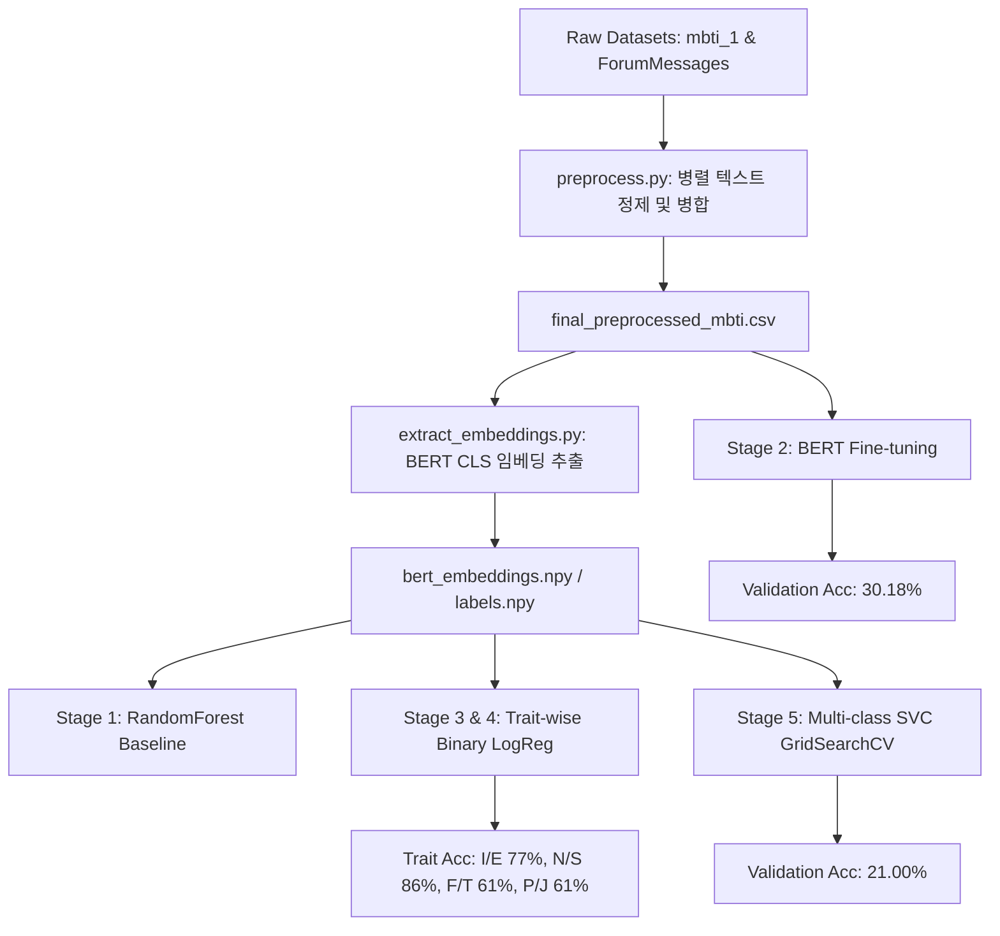

# MBTI Text Classification Project

대규모 온라인 포럼 게시글 데이터를 활용하여 작성자의 MBTI 성격 유형을 예측하는 머신러닝 및 딥러닝 모델링 파이프라인입니다. 

사전 학습된 언어 모델(BERT)의 임베딩 추출, 파인튜닝, 각 성격 차원별 이진 분류 및 머신러닝 기법(RandomForest, SVM)의 그리드 탐색 코드를 유기적으로 연동하여 동작하도록 구현했습니다.

---

## 프로젝트 아키텍처

파이프라인은 데이터 수집부터 최종 모델 검증 단계까지 총 5개의 단계로 분할되어 동작합니다.



---

## 개발 및 실행 환경

- 실행 환경: Docker Container (mbti-container)
- Base Image: pytorch/pytorch:2.0.1-cuda11.7-cudnn8-runtime (Python 3.10)
- 하드웨어 가속: NVIDIA GeForce RTX 3090 (CUDA 호환 활성화)
- 주요 라이브러리: torch==2.0.1, transformers==4.39.3, scikit-learn==1.3.0, pandas, nltk, tqdm, joblib, matplotlib

---

## 데이터 전처리 및 말뭉치 통합 (preprocess.py)

ProcessPoolExecutor 기반 멀티프로세싱(35개 CPU 코어 분산) 시스템으로 구축하여 텍스트 정제 속도를 최적화했습니다.

1. 데이터 정제 과정: 소문자 변환, URL 및 특수 문자 제거, NLTK 토큰화, 불용어 제거, 표제어 추출(Lemmatization).
2. 말뭉치 필터링 및 병합: mbti_1.csv와 ForumMessages.csv를 user_id 기준으로 조인하고, 길이가 2 이하이거나 전체 등장 빈도가 5회 미만인 희귀 토큰을 제거하여 vocabulary 크기를 147,461개에서 33,886개로 축소했습니다. 빈 행 제거 후 최종 174,839행의 데이터셋(final_preprocessed_mbti.csv)을 생성했습니다.

---

## 단계별 모델 구현 방식

학습 및 검증은 train_pipeline.py를 실행하여 아래 5개 단계를 수행합니다.

- Stage 1: RandomForest Baseline (train_baseline.py)
  bert-base-uncased 모델의 마지막 레이어 CLS 토큰 임베딩(768차원)을 입력 피처로 받아 RandomForestClassifier를 학습합니다.

- Stage 2: BERT Fine-Tuning & Evaluation (train_finetune.py)
  BertForSequenceClassification(num_labels=16) 모델을 활용하여 전체 파라미터 미세 조정을 수행합니다. 가중치는 /data/bert_mbti_epoch2.pt에 저장되며, 이미 파일이 존재할 경우 학습을 생략하고 바로 평가 모드로 동작합니다.

- Stage 3 & 4: Trait-wise 이진 분류 (train_binary.py)
  MBTI의 4가지 축(I/E, N/S, F/T, P/J)을 독립적으로 분류하는 4개의 이진 LogisticRegression 모델을 생성하고 학습합니다.

- Stage 5: Multi-class SVC 최적화 및 그리드 탐색 (train_svc.py)
  5,000개의 stratified 서브셋으로 C: [0.1, 1, 10], kernel: ['linear', 'rbf'], gamma: ['scale', 'auto'] 하이퍼파라미터를 탐색합니다. 최적 파라미터가 명세서 제약인 C=1, kernel='rbf', gamma='auto'와 일치하지 않더라도 제약 사양에 강제 매칭한 최종 가중치를 20,000개 샘플 기반으로 재학습하여 저장합니다. (저장 경로: /data/best_svc_model.joblib)

---

## 학습 및 검증 결과

### 성능 지표 종합

| 단계 | 모델 이름 | 예측 모드 | 정확도 (Accuracy) | 비고 |
| :--- | :--- | :--- | :---: | :--- |
| Stage 1 | RandomForest Baseline | 16개 클래스 분류 | 21.00% | CLS 임베딩 기준점 제공 |
| Stage 2 | Fine-tuned BERT (Epoch 2) | 16개 클래스 분류 | 30.18% | 다중 분류 최고 성능 |
| Stage 3 & 4 | Binary Logistic Regression (I/E) | 성격 축 이진 분류 | 77.00% | Introversion 편향 성향 존재 |
| Stage 3 & 4 | Binary Logistic Regression (N/S) | 성격 축 이진 분류 | 86.00% | 성격 축 최고 성능 |
| Stage 3 & 4 | Binary Logistic Regression (F/T) | 성격 축 이진 분류 | 61.00% | - |
| Stage 3 & 4 | Binary Logistic Regression (P/J) | 성격 축 이진 분류 | 61.00% | - |
| Stage 5 | Multi-class SVC (Optimized) | 16개 클래스 분류 | 21.00% | 명세 제약 매칭 최종 모델 |

### 성능 시각화 차트
- 16개 다중 클래스 성능 비교 차트: mbti_16class_comparison.png
- 성격 유형 차원별 이진 분류 성능 차트: mbti_traits_comparison.png

---

## 주요 문제 해결 및 최적화 기록

1. GPU 0 과열 우회: 시스템 가동 중 GPU 0번 온도가 한계치에 도달해 드라이버 에러가 발생하는 문제를 방지하기 위해 코드 상단에 CUDA_VISIBLE_DEVICES="1,2"를 선언하여 GPU 1번과 2번을 사용하도록 우회 설정했습니다.
2. 호스트 디스크 공간 초과 해결: 여유 공간 부족 문제를 해결하기 위해 conda clean -a -y 및 기존 캐시 파일을 정리하여 42GB의 여유 디스크 공간을 선제 확보한 뒤 학습 데이터 쓰기 작업을 완료했습니다.
3. Docker SHM 에러 방지: PyTorch Dataloader 사용 시 버스 에러를 방지하고자 Docker 구동 인수에 --shm-size=16g를 설정해 대용량 공유 메모리를 확보했습니다.

---

## 실행 방법

### 1) 컨테이너 기동 및 환경 확인
```bash
# Docker 이미지 빌드
docker build -t mbti-pipeline:latest /userHome/userhome4/sehoon/MBTI_Project

# 컨테이너 실행
docker run -d --name mbti-container --gpus all \
  --shm-size=16g \
  -v /userHome/userhome4/sehoon/MBTI_Project:/workspace \
  -v /userHome/userhome4/sehoon/MBTI_Project/data:/data \
  mbti-pipeline:latest tail -f /dev/null
```

### 2) 파이프라인 일괄 기동
```bash
# 전체 단계 (Stage 1~5) 일괄 순차 학습 및 검증
docker exec mbti-container python /workspace/train_pipeline.py
```

### 3) 결과물 저장 위치 확인
모든 결과 파일은 컨테이너 내부의 /data 및 호스트의 마운트 폴더 /userHome/userhome4/sehoon/MBTI_Project/outputs/에 저장됩니다.
```bash
ls -lh /userHome/userhome4/sehoon/MBTI_Project/outputs/
```
