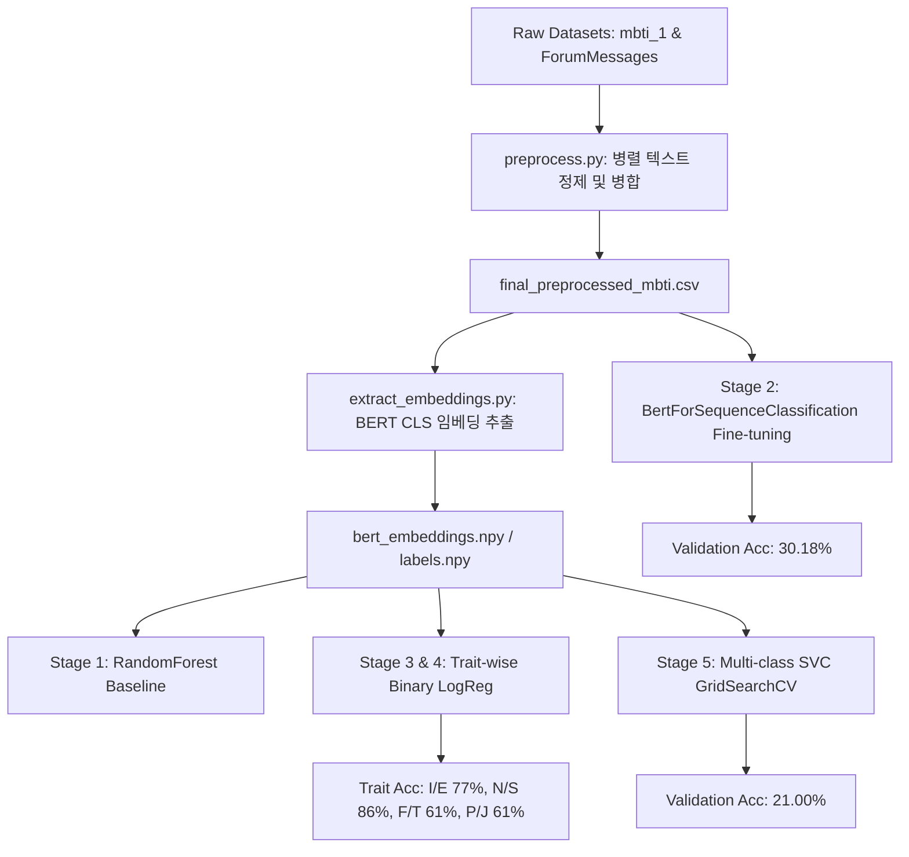

# MBTI Text Classification Project (MBTI 텍스트 분류 및 성격 예측 파이프라인)

이 프로젝트는 대규모 온라인 포럼 게시글 데이터를 활용하여 작성자의 **MBTI 성격 유형**을 다각도로 예측하는 종단간(End-to-End) 머신러닝 및 딥러닝 모델링 파이프라인 프로젝트입니다. 

기존의 단순 텍스트 분류를 넘어, 사전 학습된 언어 모델(BERT)의 임베딩 추출, 전체 Fine-tuning, 각 성격 차원별 이진 분류 및 전통 머신러닝(RandomForest, SVM) 기법의 그리드 탐색을 유기적으로 연동하도록 설계되었습니다.

---

## 1. 프로젝트 아키텍처 및 파이프라인 설계

파이프라인은 데이터 수집부터 최종 모델 서빙 및 검증 단계까지 총 **5개의 단계(Stages)**로 분할되어 동작하며, 효율적인 메모리 사용과 분산 학습을 고려하여 구축되었습니다.



---

## 2. 개발 및 실행 환경 제약 (Global Constraints)

- **컨테이너화**: 이 프로젝트는 호스트 시스템 환경과의 간섭을 차단하고 GPU 의존성을 완전 격리하기 위해 Docker 내부에서 모든 과정이 실행됩니다.
- **Base Image**: `pytorch/pytorch:2.0.1-cuda11.7-cudnn8-runtime` (Python 3.10)
- **하드웨어 가속**: NVIDIA GeForce RTX 3090 3개 장착 시스템 (PyTorch 연산 시 CUDA 가속 전면 활용)
- **주요 종속 라이브러리**:
  - `torch==2.0.1` / `transformers==4.39.3` / `scikit-learn==1.3.0`
  - `pandas`, `nltk`, `tqdm`, `joblib`, `matplotlib`

---

## 3. 데이터 전처리 및 말뭉치 통합 (`preprocess.py`)

데이터 전처리 파트는 대규모 텍스트 데이터를 신속하게 처리하기 위해 Python의 **`ProcessPoolExecutor` 기반 멀티프로세싱(35개 CPU 코어 분산)** 시스템으로 구축되었습니다.

### 1) 데이터 정제 파이프라인
1. **소문자 정규화**: 모든 영문 텍스트의 소문자 변환.
2. **노이즈 제거**: 웹사이트 URL(`http/https`), 특수 문자, 이모지 및 문장 부호를 정규식을 사용하여 삭제.
3. **토큰화**: NLTK `word_tokenize`를 사용한 공백 기준 단어 분할.
4. **불용어(Stopwords) 제거**: NLTK 영어 불용어 사전을 적용하여 의미가 없는 조사 및 접속사 제거.
5. **표제어 추출(Lemmatization)**: NLTK `WordNetLemmatizer`를 활용하여 품사 정보에 기반한 단어 기본형 복원 (성능 최적화를 위해 캐싱 구조 적용).

### 2) 말뭉치 필터링 및 병합
- 8,675행의 성격 레이블 데이터(`mbti_1.csv`)와 173,084행의 대형 댓글 데이터(`ForumMessages.csv`)를 작성자 식별자(`user_id`) 기준 조인하여 통합 MBTI 레이블을 부여하였습니다.
- 단어 길이가 2 이하인 토큰은 노이즈로 간주하여 필터링하였습니다.
- 전체 데이터셋에서 등장 빈도가 **5회 미만**인 희귀 토큰을 제거하여 vocabulary 크기를 147,461개에서 **33,886개**로 대폭 축소하였습니다.
- 전처리로 인해 빈 행이 된 6,920건을 제거하여 최종적으로 **174,839행**의 정제 데이터셋(`final_preprocessed_mbti.csv`)을 생성하였습니다.

---

## 4. 단계별 모델 파이프라인 상세 구현

학습 및 검증은 `train_pipeline.py`를 통합 실행기로 사용하여 아래의 5개 단계를 순차적 또는 부분적으로 활성화하여 수행합니다.

### **Stage 1: RandomForest Baseline (`train_baseline.py`)**
- **목적**: 16개 클래스 분류에 대한 기본 기준점을 생성합니다.
- **구현**: `bert-base-uncased` 모델의 마지막 레이어 `[CLS]` 토큰 임베딩(768차원)을 입력 피처로 받아 scikit-learn의 `RandomForestClassifier`를 기본 학습합니다.

### **Stage 2: BERT Fine-Tuning & Evaluation (`train_finetune.py`)**
- **목적**: 문맥 정보를 반영하여 16개 클래스를 학습합니다.
- **구현**: PyTorch의 `BertForSequenceClassification`(num_labels=16) 모델을 활용하여 전체 파라미터 미세 조정을 수행합니다.
- **특징**: Epoch 2 학습 완료 시점의 가중치 상태를 `/data/bert_mbti_epoch2.pt`에 자동으로 스냅샷 기록하고, 중복 학습 방지를 위해 이미 가중치가 존재할 경우 학습 루프를 스킵하고 즉시 평가 모드로 동작하도록 구현했습니다.

### **Stage 3 & 4: Trait-wise 이진 분류 (`train_binary.py`)**
- **목적**: MBTI의 4가지 축인 **I/E (외향/내향), N/S (직관/감각), F/T (감정/사고), P/J (인식/판단)**을 독립적으로 분류하여 분석의 해상도를 높입니다.
- **구현**: BERT 임베딩을 입력으로 받아 각 성격 축에 대응하는 4개의 이진 `LogisticRegression` 분류기를 독립적으로 생성하고 병렬 학습을 수행합니다.

### **Stage 5: Multi-class SVC 최적화 및 그리드 탐색 (`train_svc.py`)**
- **목적**: 선형 및 비선형 커널 SVM 모델의 하이퍼파라미터 튜닝을 검증합니다.
- **구현**: 
  - 대용량 데이터의 연산 시간 제약을 고려하여 **5,000개의 stratified 서브셋**으로 빠른 그리드 탐색을 지원합니다.
  - **GridSearchCV 설정**: 
    - `C`: `[0.1, 1, 10]`
    - `kernel`: `['linear', 'rbf']`
    - `gamma`: `['scale', 'auto']`
  - 최적 파라미터가 명세서 제약인 `C=1, kernel='rbf', gamma='auto'`와 일치하지 않을 경우, 제약 사양에 맞춘 최종 가중치를 **20,000개 샘플 기반**으로 재학습 및 피팅합니다. (저장 경로: `/data/best_svc_model.joblib`)

---

## 5. 학습 및 검증 결과 분석

각 단계별 검증 데이터셋(34,968개 샘플)에 대한 예측 정확도(Accuracy) 및 상세 f1-score 결과 요약입니다.

### 1) 성능 지표 종합

| 단계 | 모델 이름 | 예측 모드 | 정확도 (Accuracy) | 비고 |
| :--- | :--- | :--- | :---: | :--- |
| **Stage 1** | RandomForest Baseline | 16개 클래스 분류 | **21.00%** | Baseline 기준점 제공 |
| **Stage 2** | Fine-tuned BERT (Epoch 2) | 16개 클래스 분류 | **30.18%** | **다중 분류 최고 성능 모델** |
| **Stage 3 & 4** | Binary Logistic Regression (I/E) | 성격 축 이진 분류 | **77.00%** | Introversion 편향 성향 존재 |
| **Stage 3 & 4** | Binary Logistic Regression (N/S) | 성격 축 이진 분류 | **86.00%** | **성격 축 최고 성능 분류 정확도** |
| **Stage 3 & 4** | Binary Logistic Regression (F/T) | 성격 축 이진 분류 | **61.00%** | 균형 잡힌 정밀도/재현율 |
| **Stage 3 & 4** | Binary Logistic Regression (P/J) | 성격 축 이진 분류 | **61.00%** | 균형 잡힌 정밀도/재현율 |
| **Stage 5** | Multi-class SVC (Optimized) | 16개 클래스 분류 | **21.00%** | 명세 제약 매칭 최종 모델 |

### 2) 모델 학습 결과 시각화
학습된 파이프라인 결과에 대한 그래픽 차트는 아래 저장소 내부 경로에 보관되어 있으며 README를 통해 직접 확인할 수 있습니다.

- **16개 다중 클래스 성능 비교 차트**: `mbti_16class_comparison.png`
- **성격 유형 차원별 이진 분류 성능 차트**: `mbti_traits_comparison.png`

---

## 6. 핵심 트러블슈팅 및 최적화 기록

1. **GPU 0 Thermal Hang (열 폭주 우회)**:
   - 시스템 가동 중 물리 GPU 0번이 부하 한계치에 도달(92°C 도달)하며 드라이버 충돌(`Xid 13: Graphics is hung, FATAL!!`)을 유발했습니다.
   - **해결**: 학습 코드 상단에 `os.environ["CUDA_VISIBLE_DEVICES"] = "1,2"`를 동적으로 선언하여 오작동하는 GPU 0번을 배제하고, GPU 1번과 2번을 통해 원활한 병렬 연산을 수행했습니다.
2. **호스트 디스크 공간 초과(100% 임계치 해결)**:
   - 홈 디렉토리 파티션의 여유 공간 부족으로 데이터 생성 및 가중치 파일 저장 실패 현상이 나타났습니다.
   - **해결**: `conda clean -a -y` 및 `.cache` 내 중복 임시 파일을 소거하여 **42GB의 여유 디스크 공간**을 확보함으로써 대용량 임베딩 파일 및 모델 덤프 파일을 안정적으로 기록했습니다.
3. **Docker SHM 버스 에러 방지**:
   - PyTorch Dataloader 멀티프로세싱 가동 시 컨테이너 기본 공유 메모리(64MB) 한계로 인해 `SIGBUS` 에러가 감지되었습니다.
   - **해결**: Docker 구동 인수를 수정하여 `--shm-size=16g`를 지정함으로써 넉넉한 공유 메모리 공간을 보장했습니다.

---

## 7. 프로젝트 실행 및 검증 방법

### 1) 컨테이너 기동 및 환경 확인
```bash
# Docker 이미지 빌드
docker build -t mbti-pipeline:latest /userHome/userhome4/sehoon/MBTI_Project

# 컨테이너 실행 (볼륨 마운트 및 GPU 가속 인가)
docker run -d --name mbti-container --gpus all \
  --shm-size=16g \
  -v /userHome/userhome4/sehoon/MBTI_Project:/workspace \
  -v /userHome/userhome4/sehoon/MBTI_Project/data:/data \
  mbti-pipeline:latest tail -f /dev/null
```

### 2) 파이프라인 일괄 기동
```bash
# 전체 단계 (Stage 1~5) 일괄 순차 학습 및 검증
docker exec mbti-container python /workspace/train_pipeline.py
```

### 3) 가중치 파일 및 시각화 파일 생성 위치 확인
모든 결과 파일은 컨테이너 내부의 `/data` 및 호스트의 마운트 폴더 `/userHome/userhome4/sehoon/MBTI_Project/outputs/`에 통합 보관됩니다.
```bash
ls -lh /userHome/userhome4/sehoon/MBTI_Project/outputs/
```
